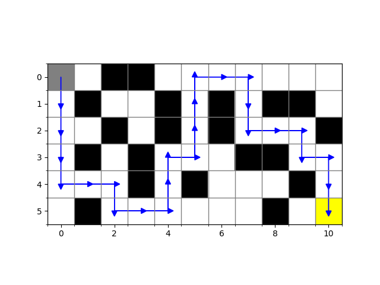

# IA Rato Labirinto
Esse é um agente inteligente que soluciona o clássico problema de busca e usa busca em profundidade para simular um rato buscando um queijo em um labirinto. Utiliza matplotlib para representar o labirinto de forma gráfica.
Tal algoritmo poderia resolver problemas como no clássico jogo do [Pac-Man](https://pt.wikipedia.org/wiki/Pac-Man) onde os fantasmas buscam a posição do Pac-man, ou até mesmo para encontrar a rota do ponta A até o ponto B
 em jogos como os clássicos [Heroes of Might and Magic](https://en.wikipedia.org/wiki/Heroes_of_Might_and_Magic).

### Requisitos
- Python 3.10
- matplotlib
- numpy
Você pode instalar as dependências usando o seguinte comando:
```bash
pip install matplotlib numpy
```

### Implementação em linha de comando:
Uso
1. Execute o arquivo main.py.
2. O programa lerá o labirinto definido no código e tentará encontrar um caminho do ponto "R" (Rato) até o objetivo "Q" (Queijo).
Caso encontre, o programa plotará um gráfico visualizando o labirinto e o caminho encontrado. Caso contrário, uma mensagem indicando que não há caminho será exibida.
Exemplo de saída:

```bash
python main.py
```
```
(0, 0)
(1, 0)
(2, 0)
(3, 0)
(4, 0)
(4, 1)
(4, 2)
(5, 2)
(5, 3)
(5, 4)
(4, 4)
(3, 4)
(3, 5)
(2, 5)
(1, 5)
(0, 5)
(0, 6)
(0, 7)
(1, 7)
(2, 7)
(2, 8)
(2, 9)
(3, 9)
(3, 10)
(4, 10)
(5, 10)
```
E um gráfico será exibido, mostrando o labirinto e o caminho encontrado:


Ou caso não encontre
```
Não há caminho até o queijo.
```

### Autor
Este projeto foi desenvolvido por [Jefferson Rosa](https://github.com/jeffersonrosa/).

### Licença
Este projeto está licenciado sob a Licença MIT - veja o arquivo [LICENSE](LICENSE) para detalhes.